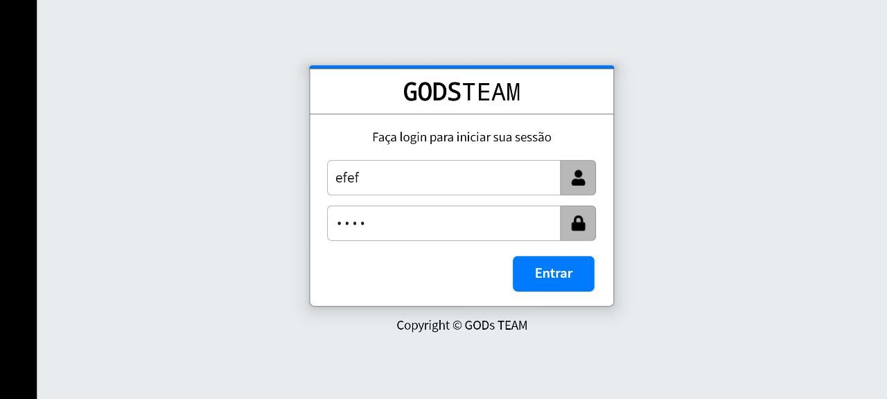

# Android Login Form in Java with Godsteam layout
Login form with Godsteam layout in Java only. 

**There is no PHP and menu source, you must implement them by yourself. See my login form with combined login + menu example: [Link 1](https://github.com/LGLTeam/Android-Login-Form-Java) and [Link 2](https://github.com/LGLTeam/Android-Login-Form-Java-2)**

Follow our Telegram channel for latest updates: https://t.me/Layout_musk

Thanks @springmusk026 for sharing

